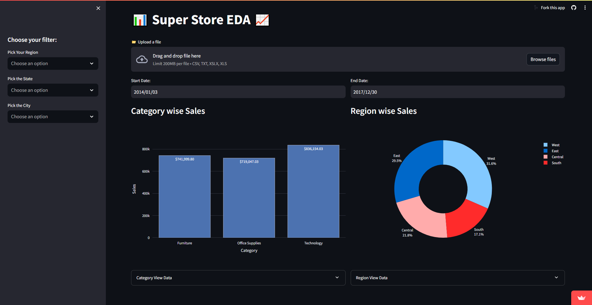
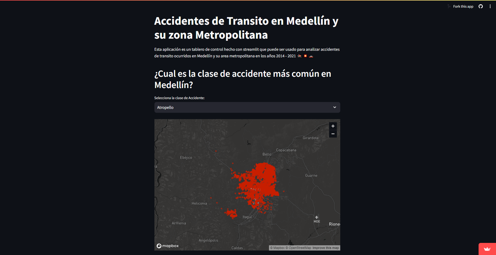

# **Data Scientist**

#### Technical Skills:

 
 
  
 
 
 
 
 
 
 
 
 
 
 
 
 

### Education
- Industrial Engenieer|Universidad Francisco de Paula Santander at Colombia(_Nov 2023_).
- IBM Data Science|IBM on Coursera(_May 2023_).
- Mathematics for Machine Learning and Data Science|Deep Learning AI (_Sep 2023_).

### Work Experience
Software Developer @ Seguros Bolivar SA(_Sep 2023_, _Feb 2024_).
- Design and implement full stack apps.
- Implement microservices architecture.
- API RESTful development.
- Requirements analysis.
- Database development.

## Data Science Projects

### Adidas Outlet Dashboard

This project entails a comprehensive exploratory analysis and visualization of sales data from Adidas outlets. Leveraging Python programming along with Streamlit for interactive visualizations, our primary aim is to extract valuable insights and information from the dataset.
 
[Adidas Dashboard](https://adidas-sales-dashboard-b6vvppxjmxsiqs8bgsgcv4.streamlit.app/)
  
[Github Project](https://github.com/CJ7MO/adidas-sales-dashboard)
 
### Sales Ecommerce Dashboard

This project enables the dynamic visualization of ecommerce sales trends over the years, offering real-time oversight of both sales and order workflows.
 
[Sales ECommerce](https://dashboardinteractivest.streamlit.app/)
 
[Github project](https://github.com/CJ7MO/DashBoard_interactive_st)
 
### Accident Map in medellin web app

This application is a dashboard made with streamlit that can be used to analyze traffic accidents occurred in Medellin and its metropolitan area in the years 2014 - 2021 🏍️💥🚗
 
[Accidents of Medellín](https://accidentsofmedellin.streamlit.app)
 
[Github project](https://github.com/CJ7MO/streamlit-Med)
 
### Uber ETL pipeline

The goal of this project is to perform data analytics on Uber data using various tools and technologies, including GCP Storage, Python, Compute Instance, Mage Data Pipeline Tool, BigQuery, and Looker Studio.
 
[Github project](https://github.com/CJ7MO/uber-etl-pipeline-data-engineering-project)

